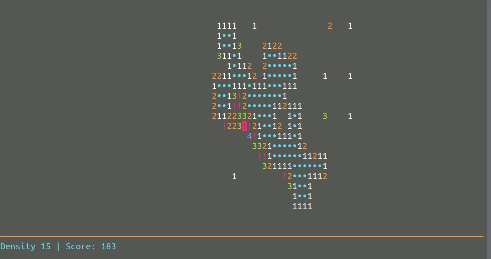

# InfiniSweep


InfiniSweep is a clone of the famous [Minesweeper](https://en.wikipedia.org/wiki/Minesweeper_%28video_game%29) game written in Haskell. It features an infinite grid which means that a game could (in theory) go on forever.

This game is played in a terminal using `ncurses` to render it.



## Download static binary

[Download latest release](https://github.com/basile-henry/infinisweep/releases/latest), make executable and then play!

For example:
```
wget https://github.com/basile-henry/infinisweep/releases/download/v1.0.0/infinisweep-x86_64-linux-static
chmod +x infinisweep-x86_64-linux-static
```

## How to play

With the following `options`:

```
Usage: infinisweep [-a|--auto-open] [-d|--density PERCENT]

Available options:
  -h,--help                Show this help text
  -a,--auto-open           Open cells automatically (as per flags/markers)
  -d,--density PERCENT     Density of the minefield, as a percentage
```

When a cell in the grid is opened it either contains a mine and therefore explodes (Game Over) or will show the player the number of mines in the neighbouring cells (there are 8 neighbouring cells).

- To move around the grid use:
 - Arrow keys (←, ↑, ↓, →)
 - W, A, S, D
 - HJKLYUBN (H - left, J - down, K - up, L - right, Y - up left, U - up right, B - down left, N - down right)
 - Number pad (1 - down left, 2 - down, 3 - down right, 4 - left, 6 - right, 7 - up left, 8 - up, 9 - up right, 5 - mark, 0 - open)
- Press space or 0 to open a cell.
- Press M, E, or 5 to mark a cell (if you think it contains a mine).
- Press Q to quit the game.
- Press R to start a new game.

If an open cell is satisfied (the number of mines the cell indicates matches the number of markers) you can click it (with space) and it will open all the remaining closed cells surrounding it that aren't marked. If you select the `auto` mode this behaviour is completely automated.

## How to build from source

For `cabal` and `stack` the `C` library `libncursesw5-dev` needs to be installed
separately. On Ubuntu:

```sh
sudo apt install libncursesw-dev
```

### Cabal

```sh
cabal new-build
```

### Stack

```sh
stack setup
stack build
```

### Nix

```sh
nix build 
```

## How to run the game

### Cabal

```sh
cabal new-exec -- infinisweep
```

### Stack

```sh
stack exec -- infinisweep
```

### Nix

```sh
result/bin/infinisweep
```

## License

This project is licensed under the MIT License.

```
Copyright (c) 2016 Basile Henry & David Eichmann
Copyright (c) 2018 Basile Henry & Nathan van Doorn
Copyright (c) 2021-2022 Basile Henry
```
